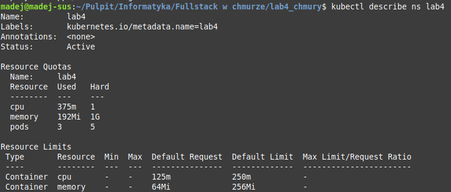
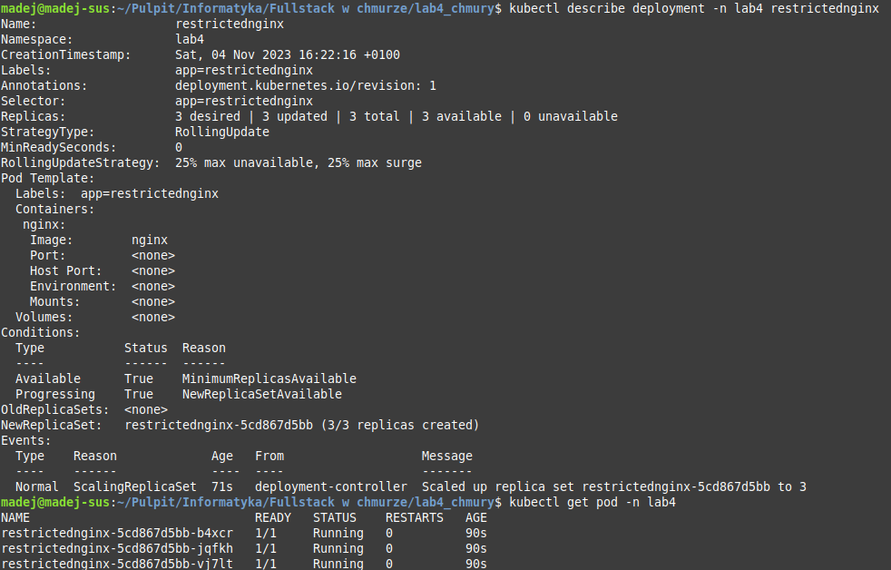

# Laboratorium 4
## Programowanie Full-Stack w Chmurze Obliczeniowej
## Kacper Madejczyk, 92937

### Część 1
Uruchomienie lokalnego klastra minikube, utworzenie plików yaml, które będą później wykorzystane do:
- `create_namespace.yaml` - utworzenia przestrzeni nazw `lab4`,
- `create_quota.yaml` - ograniczenia zasobów możliwych do wykorzystania w obrębie przestrzeni nazw `lab4`,
- `create_deployment.yaml` - uruchomienia deploymentu wg specyfikacji określonych w poleceniu.

Pliku `create_limit_range.yaml` nie dało się wygenerować w sposób analogiczny do pozostałych, trzeba go było napisać "z palca".

```
minikube start

kubectl create namespace lab4 --dry-run=client -o yaml > create_namespace.yaml
kubectl create quota lab4 -n lab4 --hard=pods=5,cpu=1000m,memory=1G --dry-run=client -o yaml > create_quota.yaml
kubectl create deployment restrictednginx -n lab4 --image=nginx --replicas=3 --dry-run=client -o yaml > create_deployment.yaml
```

### Część 2
Wykonanie instrukcji zawartych we wcześniej utworzonych plikach .yaml:
```
kubectl create -f create_namespace.yaml
kubectl apply -n lab4 -f create_quota.yaml
kubectl apply -n lab4 -f create_limit_range.yaml
kubectl apply -n lab4 -f create_deployment.yaml
```

### Część 3
Weryfikacja poprawności zastosowanej konfiguracji i działania deploymentu na środowisku lokalnym:
```
kubectl describe ns lab4
kubectl describe deployment -n lab4 restrictednginx
kubectl get pod -n lab4
kubectl describe pod -n lab4
```





Wynik ostatniego polecenia nie został tu umieszczony, ponieważ był bardzo długi.

